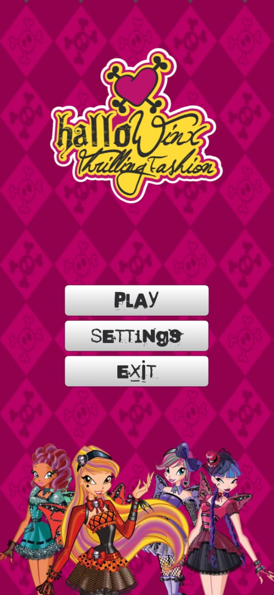
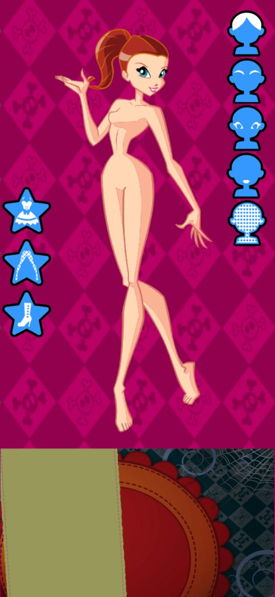

# 👗 HALLOWINX DRESS-UP 🧙‍♀️

<p align="center">
  
</p>

<p align="center">
  <b>Un juego de vestir mágico y encantador.</b>
</p>

<p align="center">
  <a href="#-descripción">Descripción</a> •
  <a href="#-características">Características</a> •
  <a href="#-cómo-jugar">Cómo jugar</a> •
  <a href="#-capturas">Capturas</a> •
  <a href="#-instalación">Instalación</a> •
  <a href="#-desarrollo">Desarrollo</a>
</p>

---

## 📖 **Descripción**

**Hallowinx Dress-up** es un encantador juego indie de vestir interactivo inspirado en el estilo mágico y la moda fantástica. Crea combinaciones únicas y dale vida a tu propio personaje en este mundo de fantasía.

> *"La moda es la forma más mágica de expresión"*

---

## ✨ **Características**

- 🎮 **Jugabilidad simple e intuitiva** - Arrastra y suelta prendas.
- 👗 **Múltiples categorías** - Vestidos, medias, zapatos, skins, pelos, ojos, cejas y labios.
- 🎨 **Gran variedad de combinaciones** - Crea tu estilo único.
- 📱 **Optimizado para móviles** - Diseño vertical y controles táctiles.
- 🔀 **Múltiples opciones** - Más de 50 prendas para combinar.

---

## 🎮 **¿Cómo jugar?**

### **Controles:**
- **🖱️ PC**: Arrastra las prendas con el mouse
- **📱 Móvil**: Toca y arrastra con el dedo

### **Mecánicas:**
1. Selecciona una categoría (vestidos, medias, zapatos)
2. Arrastra una prenda hacia el personaje para ponérsela
3. Usa los botones para cambiar skins, pelos, ojos, cejas y labios
4. ¡Crea combinaciones únicas!

### **Botones:**
- 👗 **Vestidos** - Muestra/oculta el catálogo de vestidos.
- 🧦 **Medias** - Muestra/oculta el catálogo de medias.
- 👠 **Zapatos** - Muestra/oculta el catálogo de zapatos.
- 🎨 **Skins** - Cambia entre diferentes tonos de piel.
- 💇 **Pelos** - Cambia entre diferentes peinados.
- 👀 **Ojos** - Cambia el estilo de los ojos.
- ✨ **Cejas** - Cambia las cejas.
- 👄 **Labios** - Cambia los labios.

---

## 📸 **Capturas**

<div align="center">
  
  
</div>

---

## 📲 Descargar

| Plataforma | Estado |
|-----------|--------|
| Android (.apk) | [Última versión →](https://github.com/wanxiturro/Hallowinx-dress-up-game/releases/download/0.0.7/hellowinx.apk) |
| PC | [Última versión →](https://github.com/wanxiturro/Hallowinx-dress-up-game/releases/download/0.0.7/hellowinx.apk)|


### **Desde código fuente:**
```
bash

git clone https://github.com/tuusuario/hallowinx-dressup.git
cd hallowinx-dressup
# Abre el proyecto con Godot 4.2+
```